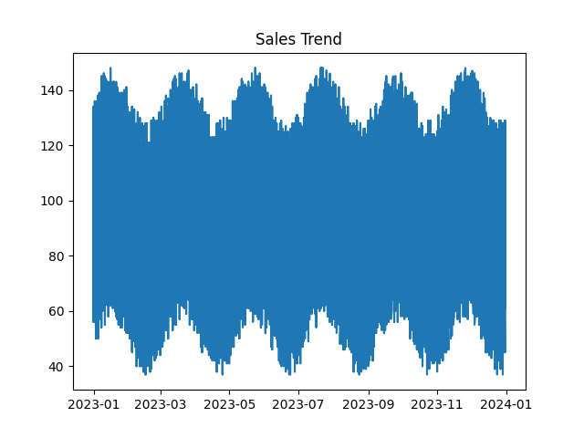
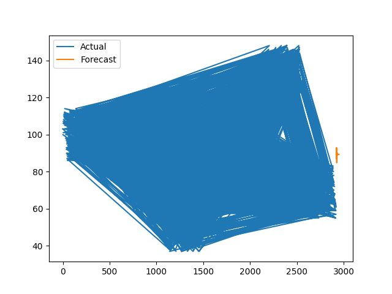

# RETAILS FORECASTING AND INVENTORY OPTIMIZATION SYSTEM
# 🛒 Retail Sales Forecasting and Inventory Optimization System

## 📌 Overview

This project is an end-to-end **Data Analytics + Machine Learning system** designed to forecast retail sales and optimize inventory decisions.

It helps businesses:

* 📈 Predict future sales trends
* 📦 Optimize inventory levels
* 💰 Reduce overstock and stockouts

---

## 🚀 Features

* 📊 Exploratory Data Analysis (EDA)
* 🧹 Data preprocessing & feature engineering
* 🔮 Time series forecasting
* 📉 Sales trend visualization
* 🏪 Multi-store & multi-category analysis
* 📦 Inventory optimization logic
* 🌐 Interactive dashboard using Streamlit

---

## 🛠️ Tech Stack

* **Python**
* **Pandas, NumPy**
* **Matplotlib**
* **Statsmodels**
* **Streamlit**

---

## 📂 Project Structure

```
├── app/
│   └── app.py
├── data/
│   └── retail_sales.csv
├── images/
│   ├── forecast.png
│   └── sales_trend.png
├── models/
├── notebooks/
│   └── eda.ipynb
├── outputs/
├── src/
│   ├── data_preprocessing.py
│   ├── feature_engineering.py
│   ├── forecasting.py
│   ├── inventory.py
│   └── visualization.py
├── main.py
├── requirements.txt
└── README.md
```

---

## ⚙️ Installation
git clone https://github.com/ArshiyaMuskan/RETAILS-FORECASTING-AND-INVENTORY-OPTIMIZATION-SYSTEM.git
pip install -r requirements.txt
```

---

## ▶️ Run the Project

### Run Streamlit App

```bash
streamlit run app/app.py
```

---

## 📊 Sample Output

* 📉 Sales Trend Visualization


* 🔮 Forecast vs Actual Comparison



---

## 💡 Use Cases

* Retail store demand forecasting
* Inventory planning
* Business decision support
* Supply chain optimization

---

## 🎯 Future Improvements

* Integration with real-time data
* Advanced ML models (LSTM, XGBoost)
* Deployment on cloud platforms
* Automated alerts for inventory

---

## 👩‍💻 Author

**Arshiya Muskan**

---

## ⭐ If you like this project

Give it a ⭐ on GitHub and share it!

